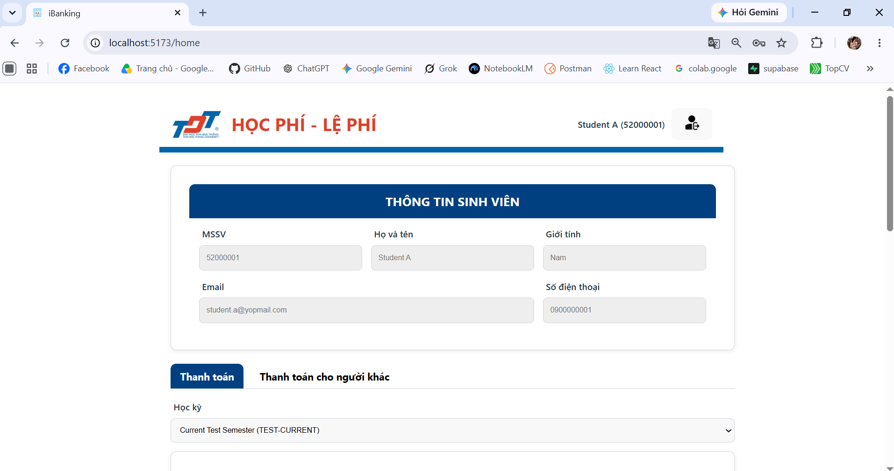
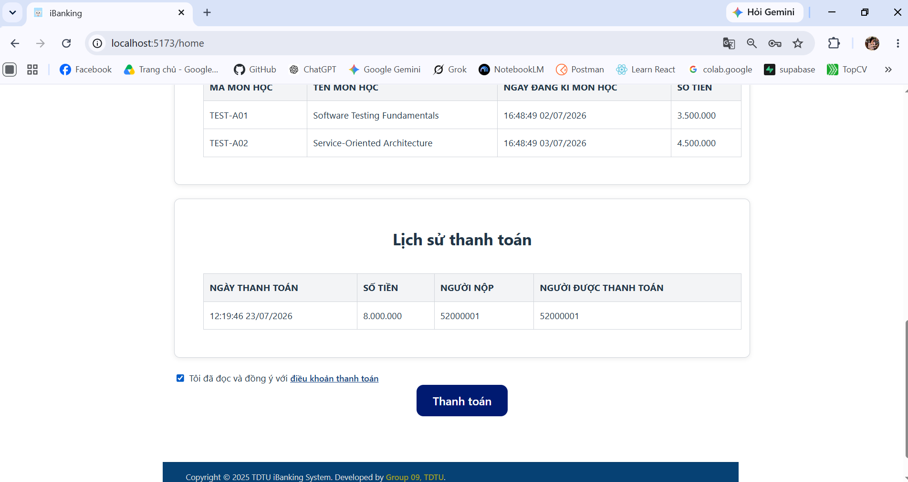
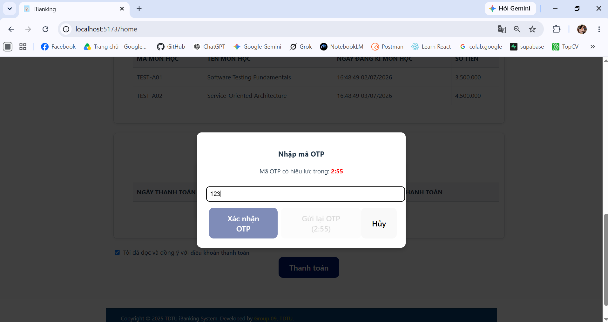

# Tuition Payment Website

## Project Overview

Tuition Payment Website is a university group project that simulates an iBanking-style web application for tuition payment. An authenticated student can review profile and tuition information, inspect invoices by semester, add funds to a simulated balance, pay an invoice for themselves or another student, confirm the payment with an email OTP, and review payment history.

The system uses a React frontend, a FastAPI API Gateway, and four FastAPI services: Auth, User, Student Fee, and Payment. Each service accesses its own Supabase schema. This repository is an educational simulation and does not connect to a real bank or payment processor.

The source supports one identifiable application actor: an authenticated student whose `username` is the university student ID (MSSV). No administrator or staff workflow is implemented.

## Main Features

- JWT-based login and protected application access.
- Student profile and simulated account-balance display.
- Semester selection and tuition-invoice lookup.
- Invoice-item and calculated-total display.
- Self-payment and payment on behalf of another student.
- Simulated balance top-up and debit operations.
- Six-digit email OTP confirmation with a 180-second application timer.
- Payment-intent lifecycle covering pending, OTP, processing, confirmation, cancellation, expiry, and failure scenarios.
- Payment history with payer and beneficiary information.
- Logout and client-side handling of invalid sessions.

## Screenshots

The screenshots below use synthetic test data and show the main web-application flows. The complete evidence set is indexed in [`docs/images`](docs/images/README.md).

### Student and tuition dashboard



| Payment history | OTP confirmation |
|---|---|
|  |  |

## Technology Stack

| Layer | Technology |
|---|---|
| Frontend | React 19, React Router, Axios, Vite 7, CSS |
| API Gateway | FastAPI, HTTPX, CORS middleware |
| Backend services | Python, FastAPI, Pydantic |
| Authentication | JWT with `python-jose`, Passlib/bcrypt, HTTP Bearer |
| Data platform | Supabase Python client and PostgREST |
| Database | Supabase-hosted PostgreSQL with service-specific schemas |
| Email | SMTP through Python `smtplib` |
| API testing | Postman and FastAPI OpenAPI/Swagger UI |

## System Architecture

```text
React Web App (:5173)
        |
        | HTTP requests + Bearer JWT
        v
FastAPI API Gateway (:8000)
   |             |             |             |
   v             v             v             v
Auth Service   User Service   Student Fee   Payment Service
   :8001          :8002          :8003          :8004
   |               |              |              |
   v               v              v              v
auth_svc       user_svc      studentfee_svc   payment_svc
        \____________ Supabase / PostgreSQL ____________/

Payment Service also calls User and Student Fee services and can send
OTP and payment-notification emails through SMTP.
```

The browser communicates with the API Gateway rather than accessing Supabase directly. Backend services use the server-side Supabase service-role key; user-level authorization remains the responsibility of the application services.

## Basic Request Flow

1. The student logs in through the API Gateway and receives a JWT from the Auth Service.
2. The React client stores the token locally and attaches it to subsequent API requests.
3. The Gateway forwards profile, balance, semester, invoice, and payment requests to the relevant service.
4. For a payment, the Payment Service obtains payer and invoice data from the User and Student Fee services, calculates the amount, and creates a payment intent.
5. The Payment Service issues an email OTP and records its expiry time.
6. After OTP confirmation, the service attempts to debit the simulated balance, mark the tuition invoice as paid, save the payment record, and send notification emails.
7. The React client refreshes the invoice, balance, and payment-history views.

## My Contributions

This was a collaborative university project. The contributions below describe the parts I worked on; they do not claim sole ownership of the application or its overall architecture.

### Software Development

- Contributed to the React payment dashboard and its non-authentication workflows, including student information, account balance, semester and invoice views, self/other-student payment flows, simulated top-up, payment history, and OTP interaction.
- Contributed to API Gateway routing and integration for the User, Student Fee, and Payment services.
- Worked on User Service components related to profile retrieval, user lookup, and simulated balance deposit/debit operations.
- Worked on Student Fee Service components related to semesters, tuition invoices, invoice items, total calculation, and invoice payment status.
- Worked on Payment Service components related to payment intents, OTP issuance and confirmation, payment processing, service-to-service calls, payment records, history, and email notifications.
- Added reproducible Supabase migrations, service-oriented database schemas, constraints, indexes, and synthetic seed data for local development and testing.
- Prepared the backend environment template and updated the frontend React and Axios dependencies.

My software-development contribution did not include the Auth Service, login page, frontend authentication client, or Auth-specific Gateway routing.

### Testing & Quality Assurance

- Analyzed source-derived functional requirements and end-to-end business flows.
- Designed manual UI and API test cases using requirement-based, boundary, decision-table, and state-transition techniques.
- Prepared a 53-case manual test suite and executed 51 cases in a local environment.
- Recorded actual results, test status, database observations, and 121 screenshot artifacts covering 50 test-case IDs.
- Documented five confirmed defects and maintained a register of potential issues found through source-code review.
- Prepared a reusable Postman collection, local environment template, endpoint inventory, and suggested execution order.
- Produced the test plan, feature and requirement analysis, execution summary, evidence index, and supporting database setup documentation.

Testing included the Auth module as part of system-level quality assurance. Testing a module is not presented as evidence that I developed that module.

## Repository Structure

```text
backend/
  auth/             Authentication service
  users/            User profile and simulated balance service
  studentfee/       Semester and tuition-invoice service
  payment/          Payment intent, OTP, history, and email logic
  gateway/          HTTP reverse-proxy API Gateway
  .env.example      Safe local environment template
frontend/
  src/pages/        Login and payment dashboard screens
  src/services/     Axios clients for Gateway endpoints
  src/assets/       Application images and icons
docs/
  requirements/     Source-derived feature and requirement analysis
  test-plan/        Manual test strategy and scope
  test-cases/       Manual UI and API test cases
  bug-reports/      Defect reports, template, and review findings
  test-reports/     Manual execution summary
  images/           Sanitized screenshots and evidence index
  database/         Reproducible Supabase setup guide
postman/            Collection, local environment, and API inventory
supabase/
  migrations/       PostgreSQL schema, constraints, and indexes
  seed.sql          Synthetic local test data
  config.toml       Local Supabase configuration
```

## Testing & Quality Assurance

### Testing Scope

The planned scope covers authentication, user profile and balance operations, semester and invoice retrieval, self/other-student payments, OTP confirmation, transaction-state changes, payment history, API validation, basic authorization checks, UI behavior, and database consistency after state-changing operations.

Performance testing, penetration testing, production-readiness certification, real banking integration, comprehensive accessibility certification, and automated test execution are outside the current evidence set.

### Testing Types

- Functional testing
- UI testing
- API testing with Postman and Swagger UI
- Negative and input-validation testing
- Authenticated versus unauthenticated access checks
- Basic regression testing
- Database validation after state-changing operations
- End-to-end payment-flow testing

### Testing Techniques

- Equivalence partitioning
- Boundary value analysis
- Decision-table coverage for balance, invoice status, and OTP state
- State-transition testing for payment intents
- Requirement-based and use-case-based testing
- Error guessing for invalid identifiers, duplicate requests, retries, and upstream failures

### Test Documentation

| Artifact | Description |
|---|---|
| [Feature overview and testable requirements](docs/requirements/feature-overview.md) | Source-derived system behavior and traceability baseline |
| [Test plan](docs/test-plan/test-plan.md) | Scope, approach, environment, risks, and deliverables |
| [Manual test cases](docs/test-cases/test-cases.md) | Detailed UI and API cases with execution status |
| [Defect report template](docs/bug-reports/defect-report-template.md) | Reusable defect-record format and severity definitions |
| [Potential issues from code review](docs/bug-reports/potential-issues.md) | Review hypotheses and execution outcomes |
| [Confirmed defect reports](docs/bug-reports/README.md) | Index of formal defects and blocked observations |
| [Manual execution summary](docs/test-reports/test-summary-report.md) | Test metrics, module status, risks, and recommendations |
| [Screenshot evidence index](docs/images/README.md) | Mapping between test cases and committed evidence |
| [Postman documentation](postman/README.md) | Collection setup, variables, endpoints, and execution order |
| [Database setup guide](docs/database/database-setup.md) | Reproducible schema and synthetic-data instructions |

### Test Results / Current Testing Status

**Execution status: Completed with exceptions**

| Metric | Result |
|---|---:|
| Designed test cases | 53 |
| Executed | 51 |
| Passed | 43 |
| Failed | 5 |
| Blocked | 3 |
| Not Run | 2 |
| Confirmed defects | 5 |
| Screenshot artifacts | 121 |
| Case IDs with screenshots | 50 of 53 |

The five confirmed defects remain documented under `docs/bug-reports/`. Two code-review hypotheses were confirmed through execution. Three authorization/state-policy cases remain blocked pending policy clarification, and two cases were not run because the required datasets were unavailable or destructive to prepare.

## Setup and Run Instructions

### Prerequisites

- Python compatible with the pinned packages in `backend/requirements.txt`
- Node.js and npm
- Supabase CLI for applying the versioned migration and seed data
- A local or hosted Supabase project
- Optional SMTP credentials; without them, development mail content is printed instead

### Database Setup

The schema and synthetic test dataset are versioned under `supabase/`. See the [database setup guide](docs/database/database-setup.md) for local and hosted-project options.

For a new linked test project:

```powershell
npx supabase link --project-ref <NEW_PROJECT_REF>
npx supabase db push --dry-run
npx supabase db push --include-seed
```

Use a disposable project or review the migration before applying it to an existing database.

### Backend Environment

Create the local environment file from the committed template and replace placeholder values. Do not commit secrets.

```powershell
Copy-Item backend\.env.example backend\.env
```

The main variables are:

```dotenv
SUPABASE_URL=<your-supabase-url>
SUPABASE_SERVICE_ROLE_KEY=<your-service-role-key>
JWT_SECRET=<shared-secret-for-all-services>
JWT_ALGORITHM=HS256
JWT_EXPIRE_MINUTES=60
AUTH_SVC_URL=http://localhost:8001
USER_SVC_URL=http://localhost:8002
STUDENTFEE_SVC_URL=http://localhost:8003
PAYMENT_SVC_URL=http://localhost:8004
USER_SERVICE_URL=http://localhost:8002/user
MAIL_FROM=no-reply@example.com
SMTP_HOST=smtp.example.com
SMTP_PORT=587
SMTP_USER=<optional-user>
SMTP_PASS=<optional-password>
```

Install the backend dependencies from the repository root:

```powershell
python -m venv .venv
.\.venv\Scripts\Activate.ps1
pip install -r backend\requirements.txt
```

### Start Backend Services

Run each process in a separate terminal from the `backend` directory:

```powershell
cd backend
uvicorn auth.main:app --reload --port 8001
```

```powershell
cd backend
uvicorn users.main:app --reload --port 8002
```

```powershell
cd backend
uvicorn studentfee.main:app --reload --port 8003
```

```powershell
cd backend
uvicorn payment.main:app --reload --port 8004
```

```powershell
cd backend
uvicorn gateway.main:app --reload --port 8000
```

### Start Frontend

```powershell
cd frontend
npm install
npm run dev
```

The frontend normally runs at `http://localhost:5173` and calls `http://localhost:8000`. Set `VITE_API_BASE_URL` if the Gateway uses another address.

### API Documentation

When a service is running, its generated OpenAPI documentation is available at `/docs`, for example:

- Auth Service: `http://localhost:8001/docs`
- User Service: `http://localhost:8002/docs`
- Student Fee Service: `http://localhost:8003/docs`
- Payment Service: `http://localhost:8004/docs`
- API Gateway: `http://localhost:8000/docs`

The Gateway schema primarily represents proxy routes; detailed request and response models are available from the downstream service documentation.

## Known Limitations

- The account balance, top-up, and payment operations are simulations with no real banking or external funding provider.
- Five confirmed defects are currently open; three test cases are blocked and two were not run.
- No automated test suite or CI test execution is included in the repository.
- The Gateway does not currently proxy `POST /auth/signup`.
- The frontend references a current-payment-intent endpoint that is not implemented by the Payment router.
- Ownership and privacy rules for accessing another student's invoice/history and mutating payment intents are not formally specified.
- OTP duration is inconsistent between active application code (180 seconds) and some email content (5 minutes).
- Cross-service balance, invoice, intent, and payment updates are not executed as one atomic database transaction.
- Services use an elevated Supabase service-role key; fine-grained user authorization depends on application logic, and table-level RLS policies are not defined in the migration.
- Formal browser support, production deployment, monitoring, and operational-security configuration remain undefined.
